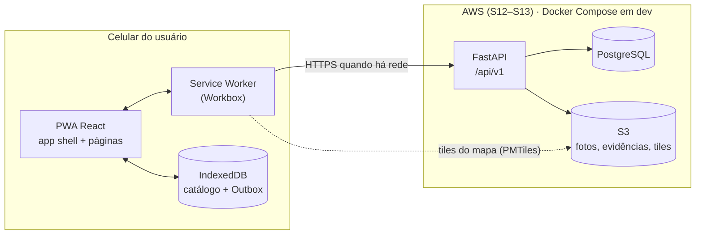
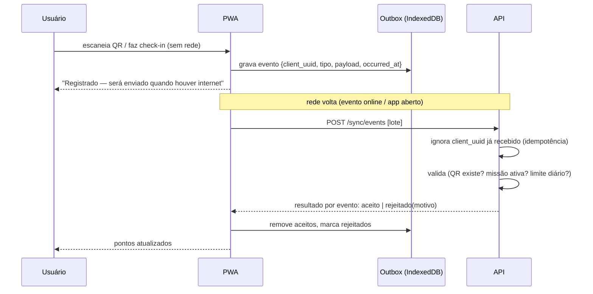

# Arquitetura do MVP

> Entrega da S2. Documento vivo: atualize quando uma decisão mudar e registre na tabela de decisões.

## Visão geral



## Frontend (PWA)

| Camada | Responsabilidade |
|---|---|
| `pages/` | uma tela por rota (Mapa, Diretório, Carroça, Passaporte, Admin) |
| `components/` | peças reutilizáveis (layout, cards, banner offline) |
| `lib/api.ts` | único ponto que fala com a API |
| `lib/db.ts` (S8) | IndexedDB via Dexie: catálogo local e fila Outbox |
| `lib/sync.ts` (S12) | pull do catálogo e push da Outbox |
| Service Worker | precache do app shell; cache de imagens e tiles |

Regra de ouro: **a tela lê do IndexedDB, não da API.** A API alimenta o IndexedDB em segundo plano.
Assim a mesma tela funciona online e offline, sem dois caminhos de código.

## Backend (FastAPI)

```
app/
├── api/routes/     # HTTP: valida entrada, chama service, devolve schema
├── services/       # regras de negócio (pontuação, aceite de corrida, validação de QR)
├── models/         # SQLAlchemy (tabelas)
├── schemas/        # Pydantic (entrada/saída)
├── core/           # config, segurança (hash, JWT), dependências de auth
└── db/             # engine, sessão, base declarativa
```

Rotas não acessam o banco diretamente para regra de negócio — isso fica em `services/`, que é o que os testes cobrem.

### Grupos de endpoints previstos

| Prefixo | Semana | Quem acessa |
|---|---|---|
| `/auth` (login, refresh, cadastro) | S5 | todos |
| `/places`, `/categories` | S5 | público (leitura), admin (escrita) |
| `/businesses` | S7 | público (leitura), parceiro (o próprio), admin |
| `/carriers`, `/ride-requests` | S9–S10 | turista, carroceiro, admin |
| `/missions`, `/rewards`, `/passport` | S10–S11 | turista, admin |
| `/sync/catalog`, `/sync/events` | S8, S12 | turista logado |
| `/admin/*` | S6 em diante | admin |

## Offline e sincronização

O PRD separa o que precisa funcionar sem rede (mapa, locais, passaporte, registro de atividades) do que depende dela (pedir carroça, atualizar dados). Dois fluxos resolvem isso:

**1. Pull do catálogo (servidor → celular).** `GET /sync/catalog?since=<timestamp>` devolve locais, estabelecimentos, categorias, missões e recompensas alterados desde a última sincronização, incluindo itens removidos (`deleted_at`). O catálogo é só-leitura para o turista, então o servidor sempre vence.

**2. Push de eventos (celular → servidor).** Ações feitas offline viram eventos na Outbox:



Por que isso quase elimina conflitos: eventos são **fatos que só se acumulam** (um check-in, uma ação ambiental). Não há dois usuários editando o mesmo registro. O único cuidado é a idempotência — por isso todo evento nasce com `client_uuid` gerado no celular, e o banco tem `UNIQUE` nessa coluna.

**Pontos só são concedidos pelo servidor.** O celular pode mostrar "pendente", mas o saldo oficial vem da tabela `points_transactions`. Isso fecha a porta para fraude trivial via DevTools.

**Pedido de carroça não entra na Outbox.** Um pedido enviado três horas depois não serve para ninguém; sem rede, a tela mostra o WhatsApp dos carroceiros como alternativa.

## Mapa offline — atenção

Os tiles do `tile.openstreetmap.org` **não podem ser baixados em lote nem cacheados para uso offline**; a política de uso do OSM proíbe isso e o servidor bloqueia quem abusa. Para o MVP:

- Gerar um arquivo **PMTiles** só com a região de Algodoal/Maiandeua (é pequeno, algumas dezenas de MB no máximo) a partir de um extrato do OpenStreetMap.
- Servir como arquivo estático (em dev, pasta `public/`; em produção, S3 + CloudFront).
- MapLibre GL lê com o plugin `pmtiles`; o Service Worker guarda o arquivo no primeiro acesso.
- Manter a atribuição "© OpenStreetMap contributors" visível no mapa (exigência da licença ODbL).

Isso resolve de uma vez: funciona offline, não depende de terceiros e o custo é só armazenamento.

## Autenticação e perfis

- Senha com hash **Argon2** (via `pwdlib`) ou bcrypt.
- JWT de acesso curto (15 min) + refresh token longo (30 dias) para o turista não precisar logar de novo ao voltar à rede depois de um dia offline.
- Perfis: `tourist`, `carrier`, `partner`, `admin` — checados por dependência do FastAPI (`require_role("admin")`).
- Consultar mapa e diretório **não exige conta** (PRD, seção 10).

## Ambientes

| Ambiente | Onde | Quando |
|---|---|---|
| Local | Docker Compose (API + PostgreSQL) + `npm run dev` | S3 |
| CI | GitHub Actions com PostgreSQL de serviço | S3 |
| Produção | AWS (a definir entre App Runner/ECS/EC2 + RDS + S3 + CloudFront) | S12–S13 |

## Registro de decisões

| # | Decisão | Motivo | Status |
|---|---|---|---|
| 1 | React + Vite (e não Vue) | ecossistema do MapLibre e de PWA mais documentado; confirmar com a equipe | proposta |
| 2 | Coordenadas em `latitude`/`longitude` numéricos, sem PostGIS | poucos pontos numa ilha; filtro por distância cabe em SQL simples. Migrar para PostGIS se precisar | proposta |
| 3 | Uma tabela `places` para tudo que aparece no mapa, com `businesses` como extensão 1:1 | o mapa consulta uma tabela só; dados comerciais ficam separados | proposta |
| 4 | Pontos como livro-razão (`points_transactions`), saldo calculado | auditável e à prova de corrida entre sincronizações | proposta |
| 5 | Tiles em PMTiles próprio | política do OSM proíbe cache offline dos tiles oficiais | proposta |
| 6 | Pedido de carroça exige conexão | pedido atrasado não tem valor; alternativa é WhatsApp | proposta |
| 7 | Carga de fotos local em dev, S3 em produção, atrás de uma interface `storage` | AWS fica para o fim do cronograma | proposta |
