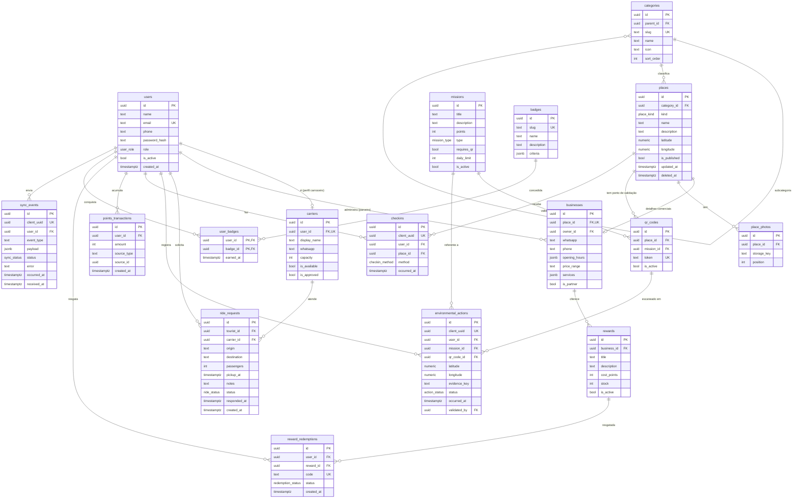

# Modelo de dados

> Entrega da S2. Derivado das entidades do PRD (seção 20). Deve ser revisado depois da validação em campo (S4) — é normal surgirem campos novos.

## Diagrama ER

## Enums

| Enum | Valores |
|---|---|
| `user_role` | `tourist`, `carrier`, `partner`, `admin` |
| `place_kind` | `beach`, `trail`, `tourist_point`, `experience`, `business`, `collection_point`, `culture` |
| `ride_status` | `pending`, `accepted`, `declined`, `cancelled`, `expired` |
| `mission_type` | `environmental`, `special` |
| `action_status` | `pending`, `validated`, `rejected` |
| `checkin_method` | `qr`, `location` |
| `redemption_status` | `issued`, `used`, `expired` |
| `sync_status` | `accepted`, `rejected` |

## Decisões e diferenças em relação ao PRD

- **`profiles` e `tourist_points` do PRD viraram outra coisa.** Dados comuns ficam em `users`; o que é específico do carroceiro em `carriers`; do comerciante em `businesses`. Praias, trilhas e pontos turísticos são `places` com `kind` diferente. Resultado: o mapa consulta **uma tabela** com filtro por categoria.
- **Categorias em árvore** (`parent_id`) reproduzem a hierarquia da seção 7 do PRD (Turismo → Praias, Alimentação → Restaurantes…).
- **`deleted_at` em `places`** (soft delete) é necessário para o pull do catálogo avisar ao celular que um local foi removido.
- **`client_uuid` com `UNIQUE`** em `checkins`, `environmental_actions` e `sync_events` garante que reenviar a Outbox não duplica pontos.
- **`points_transactions` é a fonte da verdade.** Saldo = `SUM(amount)`. Resgatar recompensa grava uma linha negativa. `source_type` + `source_id` apontam para o check-in, ação ou resgate que originou a linha.
- **`sync_events`** guarda o bruto de tudo que chegou pela Outbox, com o motivo de rejeição. É o log para depurar "meus pontos sumiram" durante o piloto.
- **Ranking** (épico 6 do PRD) não tem tabela: é uma consulta sobre `points_transactions`.
- **Horários** em `jsonb` (`{"seg": [["09:00","22:00"]], ...}`) evitam uma tabela extra que o MVP não precisa.

## Índices a criar desde o início

- `places (category_id)`, `places (updated_at)` — filtro do mapa e pull do catálogo
- `ride_requests (carrier_id, status)` — tela do carroceiro
- `points_transactions (user_id)` — saldo
- `checkins (user_id, place_id)` — passaporte

## Dados sensíveis (PRD, seção 24)

`users.phone`, `users.email`, coordenadas de `environmental_actions` e o histórico de `checkins` são dados pessoais (LGPD). Coordenadas só são gravadas quando a missão pede; nada de rastrear localização em segundo plano.
